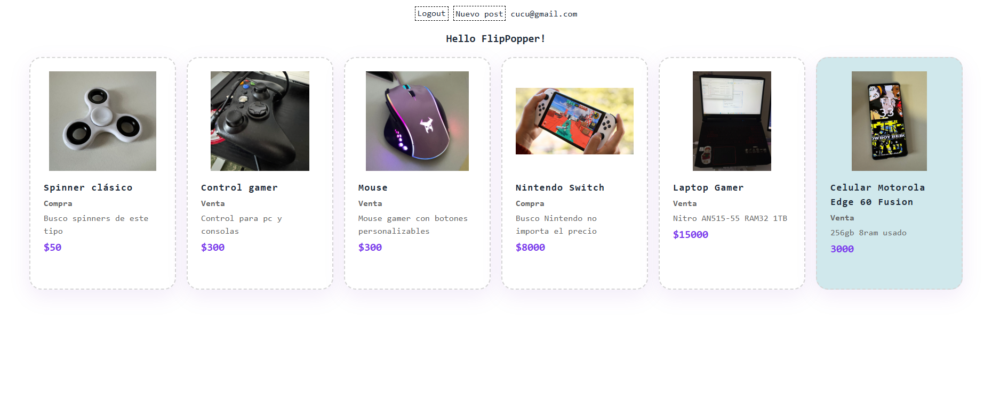

# FlipPop - clon de aplicación para compra y venta de productos

Acciones que implementa FlipPop:

- Publicar producto
- Eliminar producto
- Editar producto
- Signup
- Login
- Logout
- Visualizar listado de productos
- Visualizar detalle de producto

Cada acción se hace a través de peticiones a una API REST la cual solo permite realizar operaciones como PATCH/POST/DELETE 
si el usuario esta registrado y logueado. Esas peticiones solo se logran si la petición contiene el TOKEN JWT 
para su autenticación.

---

# Aprendizajes

Aprendizajes de frontend con javaScript:

- Uso de API REST y peticiones
- Manipulación del DOM
- Uso de arquitectura MVC

---

## Detalles a mejorar

- A la hora de publicar o editar un producto, si la imagen no se subió el formulario no permite que se suba el post
por tanto habria que ver la manera de arreglar tal bloqueo.
- Refactorización de edición de producto junto con creación de producto, probablemente se puede hacer
todo en un solo controlador y evitar duplicar código.
- Implementar tags y buscador de productos.
